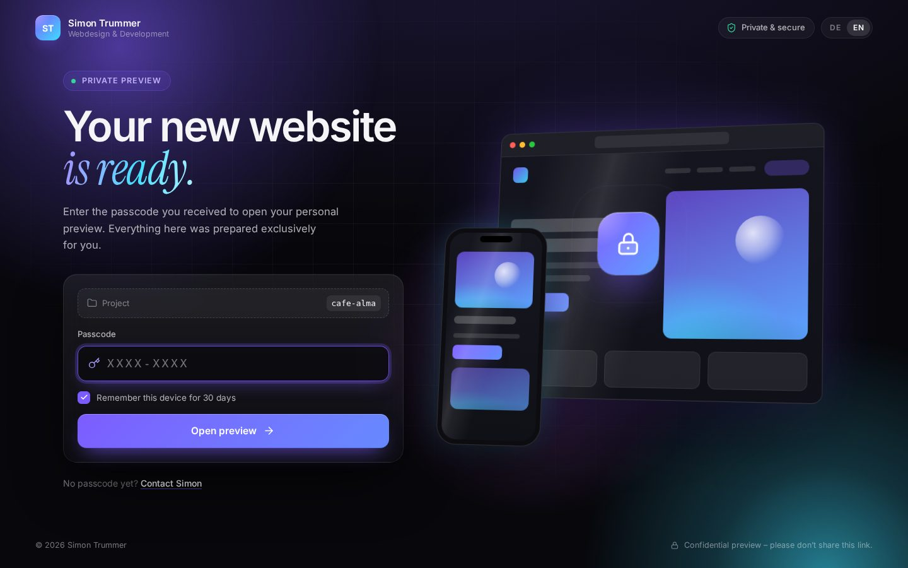
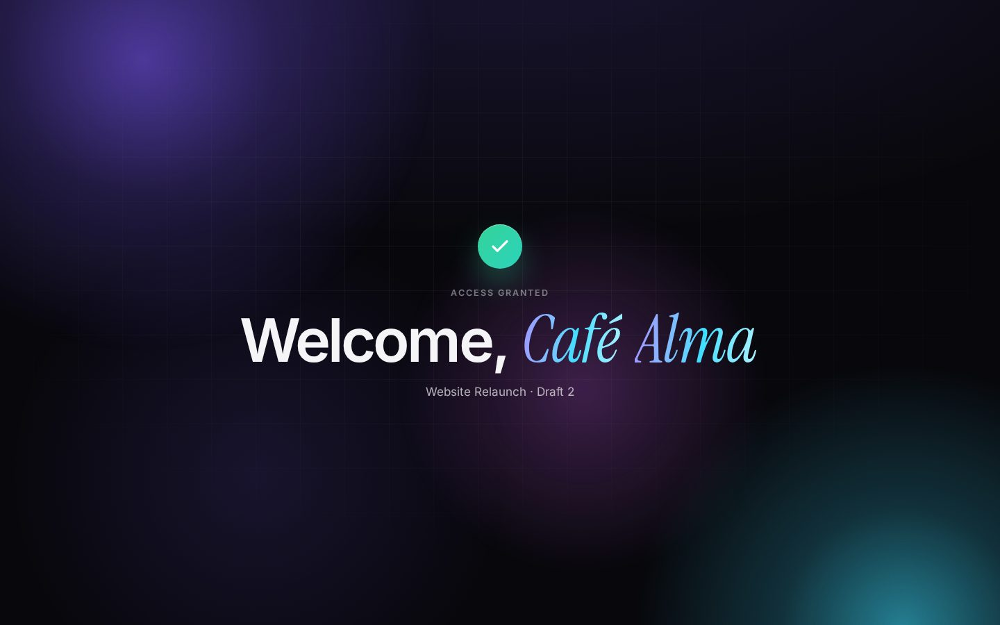
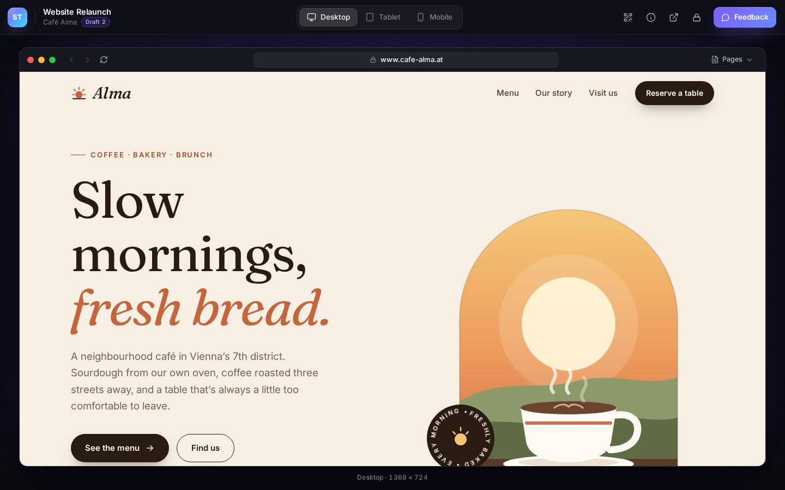
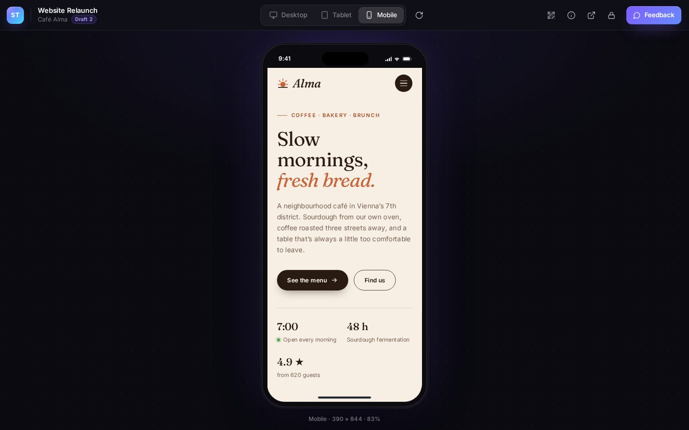
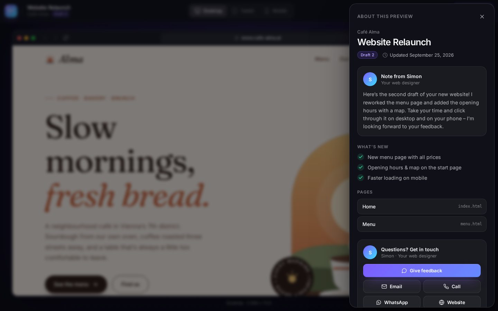
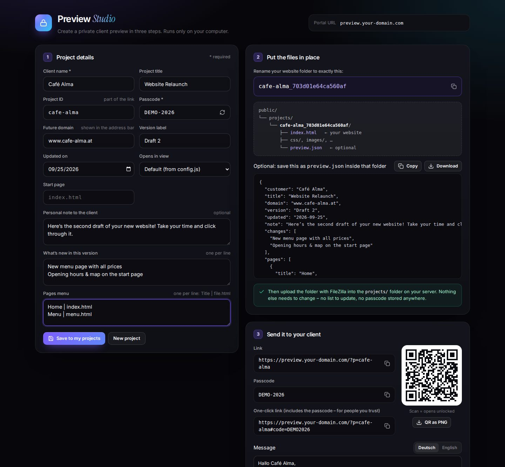

# Client Preview Portal

A private, password-protected showroom where your clients open the websites you built for them before they go live. It's a plain static website: **no backend, no database, no PHP**. You upload it with FileZilla and it runs on any web space.



Your client gets a link and a passcode. The access screen greets them, and once they type the code the site opens in a viewer. There they can flip between **desktop, tablet and smartphone** frames, send you **feedback** and open the preview **on their own phone via QR code**.

| Welcome moment | Viewer (desktop) |
|---|---|
|  |  |
| **Smartphone frame** | **Project info & feedback** |
|  |  |

---

## How it works

```
https://preview.your-domain.com/?p=cafe-alma      +   passcode  DEMO-2026
                     │                                        │
                     └──────────── SHA-256 ───────────────────┘
                                     │
                     projects/cafe-alma_703d01e64ca560af/   ← the real website
```

- Every client website sits in `public/projects/` in a folder with a **secret name**. The name is calculated from the project ID and the passcode.
- The portal calculates that name from what the client types and opens the folder. A wrong passcode points to a folder that doesn't exist, so the client sees "That passcode doesn't match."
- **Nothing secret is stored in the portal.** There's no project list and no passcodes or hashes to find in the page source, and nobody can see who your other clients are.
- The Studio helper (`tools/studio.html`) works out folder names, links, passcodes and the message to send, so you never do this by hand.

---

## Try it (2 minutes)

The passcode check needs a web server, so double-clicking `index.html` won't work. Pick one of these:

- **VS Code:** install the *Live Server* extension, right-click `public/index.html` and choose *Open with Live Server*.
- **Python:** in the `public` folder run `python -m http.server 8000` and open <http://localhost:8000/?p=cafe-alma>
- **Node.js:** `npx serve public`

Then enter the demo passcode **`DEMO-2026`**. Case, spaces and dashes don't matter, so `demo 2026` works too.

---

## Setup (once)

1. **Edit `public/config.js`.** Set your name, tagline, contact details (email, phone, WhatsApp), brand color (`accent`), `theme` (`dark` / `light` / `auto`) and `language` (`auto` / `de` / `en`). Every option is explained in the file.
2. **Optional:** add a logo (`brand.logo`) and a photo (`contact.photo`).
3. **Optional:** in `public/index.html`, change `og:image` to the full URL, e.g. `https://preview.your-domain.com/assets/img/og-image.png`. WhatsApp and iMessage then show a nice preview card when you send the link.
4. **Upload the *contents* of `public/` with FileZilla** to your web space. A subdomain like `preview.your-domain.com` looks most professional; a subfolder such as `your-domain.com/preview/` works just as well.

> The demo project (`projects/cafe-alma_…`) is there to show how things look. Delete it on your server whenever you like.

---

## Add a client project (every time)

1. Double-click **`tools/studio.html`**. It runs in your browser and stays on your computer, so there's no need to upload it.
2. Enter the client name. The Studio suggests a project ID and a strong passcode (e.g. `K7QM-4XTP`).
3. **Rename the client's website folder** to the folder name the Studio shows, e.g. `cafe-alma_703d01e64ca560af`, and put it into `public/projects/`. The site's `index.html` must sit directly inside that folder.
4. **Optional:** add the `preview.json` from the Studio to that folder (client name, title, version, a personal note, what's new, page list).
5. **Upload the folder** into `/projects/` on the server with FileZilla.
6. **Send the message.** The Studio writes it in German or English with the link and passcode. It can open it in your email app or WhatsApp, and it also makes a QR code. Click *Test the preview* to check it yourself.



That's it. You don't edit any list, and nothing else needs to be uploaded again.

- **New version for the client?** Overwrite the files in the same folder and update `version`/`changes` in `preview.json`.
- **Change a passcode or revoke access?** Rename the folder on the server (the Studio tells you the new name) or delete it. The old passcode stops working at once.
- **Forgot a passcode?** It can't be recovered, and that's by design. Create a new one in the Studio and rename the folder.

---

## What your clients get

- An access screen with an animated background, a 3D mockup and a lock that opens on success
- A personal welcome ("Welcome, Café Alma") before the website appears
- A viewer with **Desktop / Tablet / Smartphone** frames, rotation, back/forward/reload, a fake address bar showing the future domain, and a pages menu
- **Feedback**: the message goes to you by email or WhatsApp, including the page and device the client was looking at. It can also go to a form service (see below)
- A **QR code** that opens the preview unlocked on the client's own phone
- Your **personal note** and a *What's new* list for each version
- **Remember this device** for 30 days, plus a lock button
- **German & English** texts, picked automatically from the browser (and switchable)
- A phone-friendly layout, a light theme, keyboard shortcuts (`1` `2` `3`) and support for reduced motion
- **Self-hosted fonts and no external requests**, so no Google Fonts and nothing that needs a cookie banner

### `preview.json` (optional, inside each project folder)

```json
{
  "customer": "Café Alma",
  "title": "Website Relaunch",
  "domain": "www.cafe-alma.at",
  "version": "Draft 2",
  "updated": "2026-09-25",
  "device": "desktop",
  "entry": "index.html",
  "note": "Here's the second draft of your new website! …",
  "changes": ["New menu page with all prices", "Opening hours & map"],
  "pages": [{ "title": "Home", "path": "index.html" }, { "title": "Menu", "path": "menu.html" }]
}
```

Every field is optional. Any text can also be given in two languages, e.g. `"note": { "de": "…", "en": "…" }`.

### Receive feedback without the client's email app

Create a free form at [Formspree](https://formspree.io) or [Web3Forms](https://web3forms.com) and put the endpoint in `config.js` → `feedback.formEndpoint`. For Web3Forms, also add `extraFields: { access_key: '…' }`. The feedback then arrives in your inbox without the client opening their email app.

---

## Security: what this protects, and what it doesn't

**What it protects:**

- The real files live in folders with unguessable names. Without the passcode nobody can find them, not even by reading the portal's source code.
- `projects/index.html` stops the server from listing the folder contents. `robots.txt` and `noindex` keep search engines out.
- Studio passcodes have about 40 bits of randomness. Guessing one means trying hundreds of billions of combinations against your server.

**Good to know:**

- This is protection by a secret address, like Google Drive's "anyone with the link". A client who opens the site in a new tab can forward that long address, and it works without a passcode. Treat previews as *confidential*, not *top secret*.
- Short, simple passcodes like `1234` can be guessed. Use the passcodes the Studio generates.
- For truly sensitive content (unpublished prices, contracts), you can **also** turn on the password protection in your hosting panel. It's often called *Verzeichnisschutz*, *Password protect directories* or `.htpasswd`. It shows the browser's plain login box, but it's checked by the server.
- **Git:** client projects are excluded in `.gitignore` because their folder names are the secret. Keep it that way, especially if the repository is public.

---

## Tips for the client websites

- Use **relative paths** (`css/style.css`, not `/css/style.css`), because the site lives in a subfolder. With Vite set `base: './'`; with Create React App set `"homepage": "."`.
- **Static files only.** WordPress or PHP sites can't run from here; export them first (e.g. with the *Simply Static* plugin).
- Links to other websites open in a new tab automatically, so the client never gets "stuck" in the frame.
- Linux servers are case-sensitive: `Index.html` is not `index.html`.

---

## Troubleshooting

| Problem | Fix |
|---|---|
| "Passcode doesn't match" although it's right | Compare the folder name on the server with the Studio's, check that the folder is inside `/projects/` and that `index.html` sits directly in it (not in a subfolder). |
| A note says you opened the file from your computer | You double-clicked `index.html`. Use a local server (see *Try it*) or test on your web space. |
| *500 Internal Server Error* after uploading | Your host doesn't allow one of the optional `.htaccess` settings. Delete `public/.htaccess`. |
| Changes in `config.js` don't show up | The browser cached the old file. Reload with <kbd>Ctrl</kbd>+<kbd>F5</kbd> (<kbd>Cmd</kbd>+<kbd>Shift</kbd>+<kbd>R</kbd> on Mac). |
| Images/CSS missing in the preview | The site uses absolute paths (`/images/…`). Switch to relative paths. |

---

## Folder structure

```
public/                         ← upload the CONTENTS of this folder
├── index.html                  ← the portal
├── config.js                   ← your settings (the only file you need to edit)
├── robots.txt, .htaccess       ← keep search engines out (.htaccess is optional)
├── assets/                     ← styles, scripts, fonts, icons
└── projects/                   ← one folder per client (secret names)
    ├── index.html              ← blocks folder listing – keep it
    └── cafe-alma_703d01e64ca560af/   ← demo project (passcode DEMO-2026)
tools/
└── studio.html                 ← your local helper – not uploaded
docs/screenshots/               ← images for this README
```

## Other ways to solve this

- **Password protection from your host** (`.htaccess`/`.htpasswd`, *Verzeichnisschutz*): the strongest protection for no money. The downside is the browser's grey login popup, which can't be styled. It can be combined with this portal.
- **[StatiCrypt](https://github.com/robinmoisson/staticrypt)**: encrypts HTML files with a password, so it's real encryption without a server. It works per HTML page, which gets fiddly for multi-page sites with many images.
- **Hosting with access control** (Cloudflare Pages + Cloudflare Access, Netlify, Vercel): proper logins and one preview URL per project. You'd deploy with Git instead of FileZilla, and some of these features are paid.
- **Short screen recording** (e.g. a Loom video) when you only need to *show* a draft and the client doesn't need to click through it.

## Credits

- Fonts: [Inter](https://rsms.me/inter/) and [Instrument Serif](https://github.com/Instrument/instrument-serif); the demo site also uses [Fraunces](https://github.com/undercasetype/Fraunces). All under the SIL Open Font License, bundled locally (see the `LICENSE-fonts.txt` files).
- Icons based on [Lucide](https://lucide.dev) (ISC) and [Tabler Icons](https://tabler.io/icons) (MIT).
- The QR code generator follows [Project Nayuki's QR Code generator](https://www.nayuki.io/page/qr-code-generator-library) (MIT).
